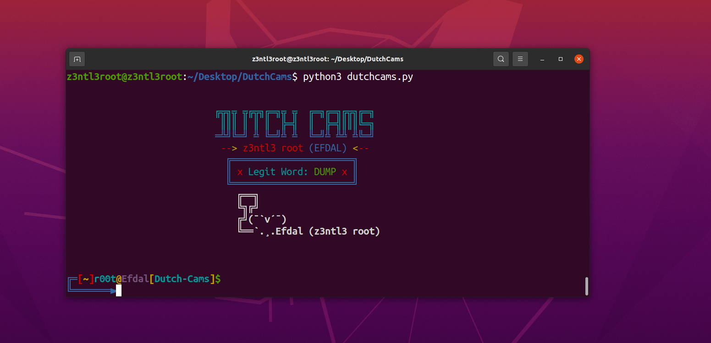
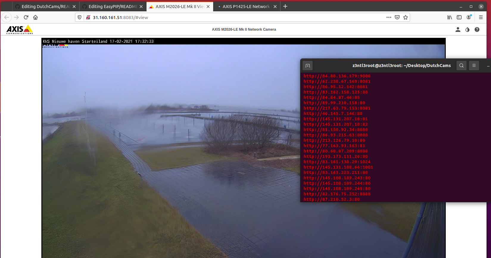

# DutchCams
Tracking random traffic and business camera in the country: Netherland. Scroll down for screenshots.

# Modules
colorama 
requests 

Writen in Python 3+ 

# Screenshot

# Installation
sudo apt update 
sudo apt-get install git 
sudo apt-get install python3 
sudo apt-get install python3-pip 
pip3 install colorama 
pip3 install requests 

git clone https://github.com/Z3NTL3/DutchCams 
cd DutchCams 
python3 dutchcams.py 
